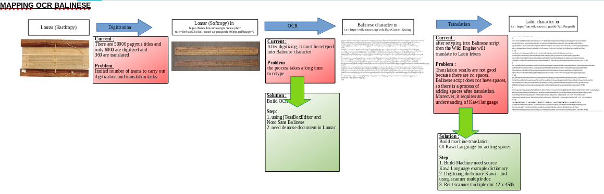
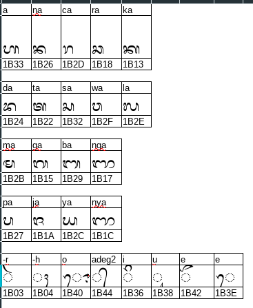
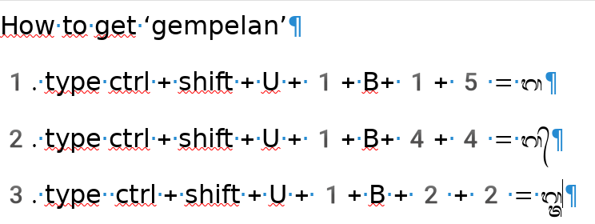
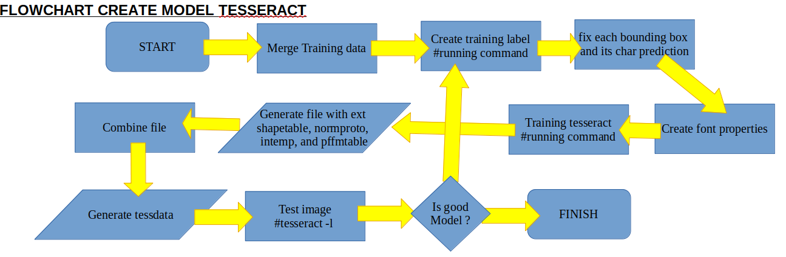

# ocr-balinese
OCR Balinese to Lontar from https://ban.wikisource.org/wiki/Kaca_Utama

# Mapping problem
.

# Tips Unicode
## Unicode Basic Noto Sans Balinese 
.
## Tips using unicode 
.

# Flowchart membuat tesseract
.